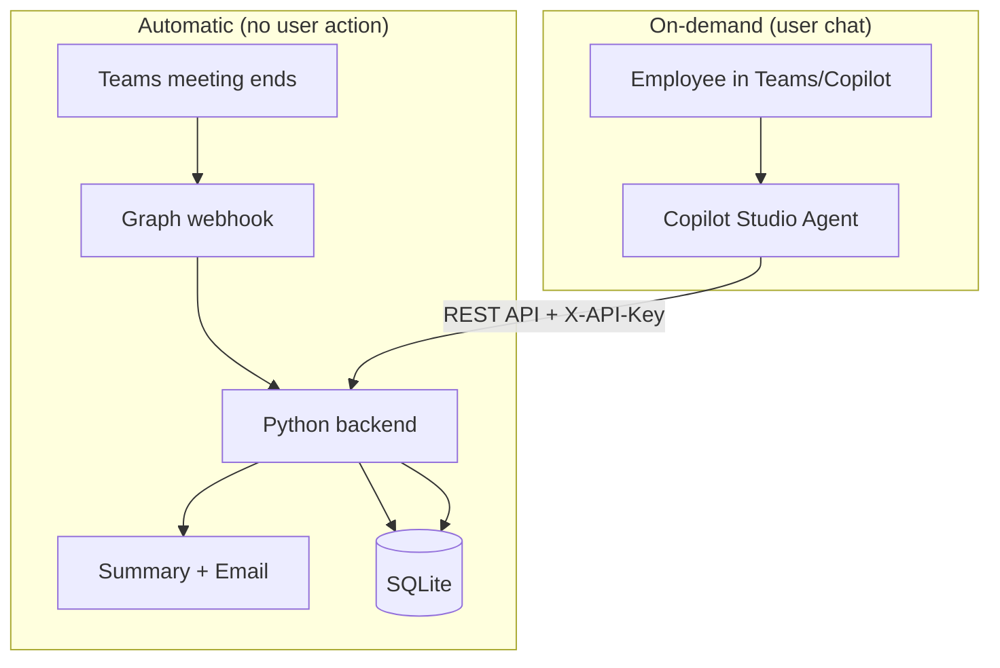

# Copilot Studio Integration Guide

This guide explains how to connect **Copilot Studio** to your Python backend so employees can chat with the agent and retrieve meeting summaries on demand.

---

## Architecture



| Layer | Role |
|-------|------|
| **Python backend** | Auto pipeline + stores summaries in DB |
| **Copilot Studio** | Chat UI — user asks questions, agent calls your APIs |
| **Azure OpenAI** | Used only inside Python for summarization (not by Copilot for this flow) |

---

## Step 1: Expose your backend publicly

Deploy the Python app to Azure App Service, Container Apps, or a VM with HTTPS.

Example base URL:
```
https://meeting-agent.yourcompany.com
```

Ensure these endpoints work:
- `GET /health`
- `GET /api/meetings/recent`
- `GET /api/meetings/search?q=...`
- `GET /api/meetings/{meeting_id}/summary`
- `POST /api/meetings/{meeting_id}/resend`

Set `COPILOT_API_KEY` in `.env` — Copilot Studio will send this in the `X-API-Key` header.

---

## Step 2: Create a Custom Connector in Copilot Studio

1. Open [Copilot Studio](https://copilotstudio.microsoft.com)
2. Go to **Tools** → **Add a tool** → **New tool** → **Custom connector**
3. Import from OpenAPI or create manually

### Option A: Import OpenAPI

Use your FastAPI OpenAPI spec:
```
https://meeting-agent.yourcompany.com/openapi.json
```

### Option B: Add actions manually

Create these 4 actions:

#### Action 1: GetRecentMeetings
| Field | Value |
|-------|-------|
| Method | GET |
| URL | `https://meeting-agent.yourcompany.com/api/meetings/recent` |
| Query | `limit` (number, optional, default 10) |
| Header | `X-API-Key`: your `COPILOT_API_KEY` |

#### Action 2: SearchMeetings
| Field | Value |
|-------|-------|
| Method | GET |
| URL | `https://meeting-agent.yourcompany.com/api/meetings/search` |
| Query | `q` (string, required), `limit` (optional) |
| Header | `X-API-Key`: your key |

#### Action 3: GetMeetingSummary
| Field | Value |
|-------|-------|
| Method | GET |
| URL | `https://meeting-agent.yourcompany.com/api/meetings/{meeting_id}/summary` |
| Path | `meeting_id` (string) |
| Header | `X-API-Key`: your key |

#### Action 4: ResendMeetingSummary
| Field | Value |
|-------|-------|
| Method | POST |
| URL | `https://meeting-agent.yourcompany.com/api/meetings/{meeting_id}/resend` |
| Path | `meeting_id` (string) |
| Header | `X-API-Key`: your key |

---

## Step 3: Create your Copilot Agent

1. **Create agent** → Name: `Meeting Intelligence Agent`
2. **Description**: "Helps you find meeting summaries, action items, and resend summary emails."
3. **Add the custom connector** as a tool/action group
4. Publish to **Microsoft Teams** (and/or M365 Copilot if licensed)

---

## Step 4: Configure Topics (conversation flows)

### Topic 1: "Show recent meetings"

**Trigger phrases:**
- "recent meetings"
- "last meetings"
- "what meetings were summarized"

**Flow:**
1. Call `GetRecentMeetings` (limit = 5)
2. If `count` = 0 → "No meeting summaries found yet."
3. Else → List `meetings[].meeting_title` and `created_at`
4. Ask: "Which meeting do you want the summary for?"

### Topic 2: "Get meeting summary"

**Trigger phrases:**
- "show summary"
- "meeting summary"
- "what happened in the meeting"

**Flow:**
1. If user gave meeting name → call `SearchMeetings` with `q`
2. If one match → call `GetMeetingSummary` with `meeting_id`
3. Display `summary` (markdown) to user
4. Ask: "Do you want me to resend this summary by email?"

### Topic 3: "Resend summary email"

**Trigger phrases:**
- "resend summary"
- "email summary again"
- "send summary to attendees"

**Flow:**
1. Resolve `meeting_id` (from context or search)
2. Call `ResendMeetingSummary`
3. Reply: "Summary sent to {recipient_count} attendees for {meeting_title}."

### Topic 4: "Action items"

**Trigger phrases:**
- "action items"
- "what are the tasks"
- "who needs to do what"

**Flow:**
1. Get summary via `GetMeetingSummary`
2. Use Copilot's generative answer to extract only the "Action Items" section from `summary`
3. Or show full summary and let the model highlight action items

---

## Step 5: Generative orchestration (recommended)

Instead of rigid topics, enable **Generative orchestration** and add instructions:

```
You are a Meeting Intelligence assistant.

When the user asks about meetings:
1. Use GetRecentMeetings for "recent" or "latest" queries.
2. Use SearchMeetings when the user mentions a meeting name or project.
3. Use GetMeetingSummary to show the full summary.
4. Use ResendMeetingSummary only when the user explicitly asks to resend or email the summary.

Always confirm before resending emails.
Never invent meeting data — only use API responses.
```

This lets Copilot decide which action to call based on natural language.

---

## API reference (for Copilot actions)

### GET /api/meetings/recent?limit=10
```json
{
  "count": 2,
  "meetings": [
    {
      "meeting_id": "MSpk...",
      "meeting_title": "Q1 Planning",
      "created_at": "2026-07-28 10:30:00"
    }
  ]
}
```

### GET /api/meetings/search?q=planning
Same shape as recent, filtered by title.

### GET /api/meetings/{meeting_id}/summary
```json
{
  "meeting_id": "MSpk...",
  "meeting_title": "Q1 Planning",
  "summary": "## Executive Summary\n- ...",
  "created_at": "2026-07-28 10:30:00",
  "attendee_count": 5
}
```

### POST /api/meetings/{meeting_id}/resend
```json
{
  "status": "sent",
  "meeting_id": "MSpk...",
  "meeting_title": "Q1 Planning",
  "recipient_count": 5
}
```

---

## Security checklist

- [ ] Use HTTPS only
- [ ] Set a strong `COPILOT_API_KEY`
- [ ] Restrict connector to your agent only
- [ ] Consider Azure AD auth instead of API key for production
- [ ] Limit who can publish/use the agent in Teams

---

## What Copilot does NOT do in this design

| Copilot does | Copilot does NOT |
|--------------|------------------|
| Chat with users in Teams | Listen to Graph webhooks |
| Call your APIs on demand | Fetch transcripts from Graph |
| Show/search stored summaries | Send auto emails after meetings |
| Resend emails when asked | Replace the Python backend |

**Auto workflow = Python backend.**  
**Chat & queries = Copilot Studio.**
